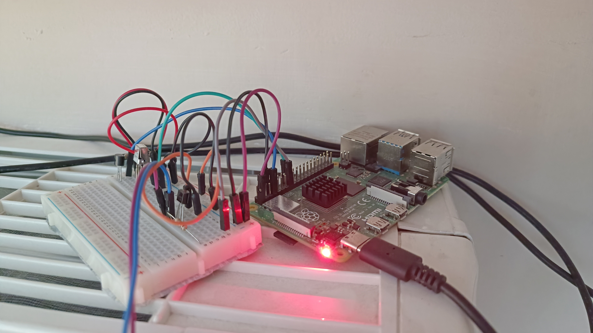
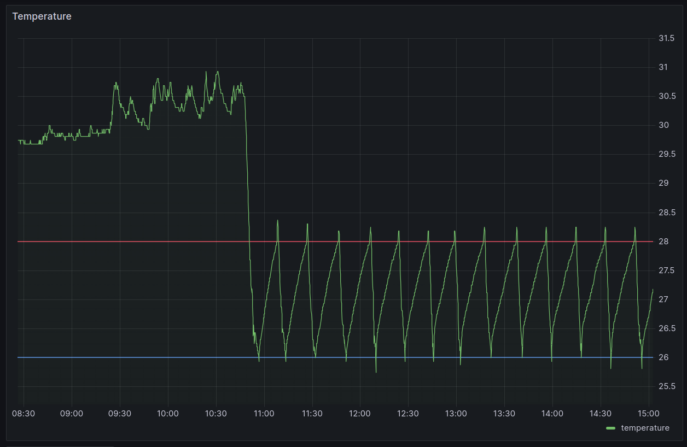

# Homemade smart air conditioner

Automate an air conditioner to keep the room temperate in a certain interval without being turned on all the time.

The setup:

Temperature graph when it's turned on:

## Hardware

- Raspberry Pi 4 Model B 4GB (1GB would be enough)
- ds18b20 temperature sensor (I had this laying around)
- vs1838b infrared receiver (same)
- infrared led (which I took from an Aliexpress rgb led strip remote controller)
- transistor, wires, etc.

## Software

- Raspbian GNU/Linux 10 (bloatware, couldn't make it work on Arch)
- LIRC (for infrared communication)
- Python (for the app)
- Flask and Jinja templating (for the UI)
- InfluxDB (for the historical data)
- Grafana (for the temperature chart)
- Docker (for InfluxDB and Grafana, because it's nearly impossible to install apps on bare-metal Debian these days)
- tmux (for running the app without soystemd)

## Sources I used

- https://www.instructables.com/Zero-to-Air-Conditioner-Controller-With-Raspberry-/
- https://medium.com/@camilloaddis/smart-air-conditioner-with-raspberry-pi-an-odissey-2a5b438fe984
- https://www.circuitbasics.com/raspberry-pi-ds18b20-temperature-sensor-tutorial/
- https://www.digikey.hu/en/maker/blogs/2021/how-to-send-and-receive-ir-signals-with-a-raspberry-pi
- https://gist.github.com/prasanthj/c15a5298eb682bde34961c322c95378b?permalink_comment_id=2986021

## Disclaimer

It's a hobby project, I didn't bother with using python properly, putting the HOST/PORT in env vars, making the UI pretty, or using normal passwords in my local network. It's for practical purposes, made in ~1 day, not in three months, and it's not for production.
